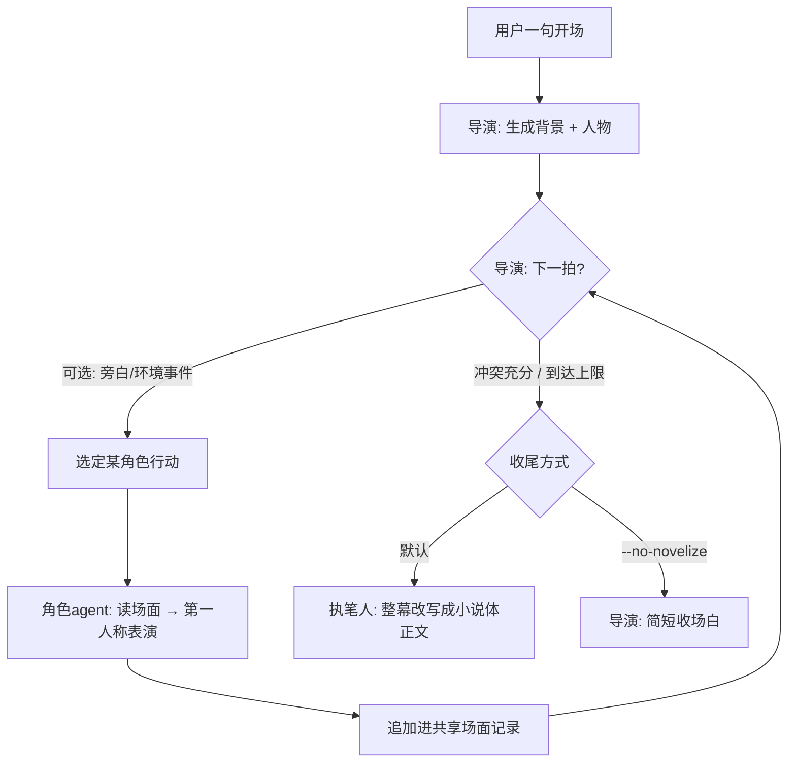
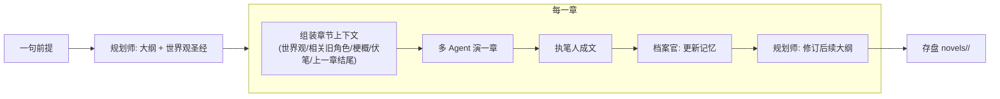

# 武侠剧场 · Wuxia Novel

给一句开场（如"雨夜，一个蒙面人踹开了客栈的门"），由一个**导演/说书人 agent** 现场生成人物与背景，调度多个**角色 agent** 轮番登场演一幕有冲突、有心机、有对话的武侠戏；最后由一个**执笔人 agent** 把整幕即兴记录改写成一章小说体正文。

> 从"渐进式 Agent 学习项目"里抽出来的独立版本，只保留武侠多 Agent 这一条线。

## 核心思路：多 Agent 产情节，单 Agent 出文笔

多角色即兴演出**读起来发散**——每个角色只有局部视角、各求自己那句"最炸"，于是像轮流朗诵、全程满格、旁白重复；而单个作者从头到尾用**全局视角**写，才有节奏张弛、心理描写、伏笔与回收。

所以刻意做成两段式，各取所长：

1. **多 Agent 即兴**（导演 + 角色）：产出带**涌现性**的原始 beats——剧情走向不预设，是人物目标碰撞出来的。
2. **单 Agent 成文**（执笔人 `Novelist`）：拿整幕 transcript 一次性改写成小说体，补心理/环境/过渡、调节奏、埋伏笔回收。

> 情节的意外感来自多 Agent，文笔的连贯感来自单 Agent。用 `--no-novelize` 关掉执笔人可直观对比两者差异。

## 难点：没有硬规则，"下一个谁行动"成了问题

不同于回合制游戏（出牌顺序由引擎确定性决定），这里**没有硬规则**约束谁该开口/出手。这正是无规则约束下多 Agent 的核心难题——**speaker selection / 调度**。

本项目用**导演/主持人调度**（对标 AutoGen 的 `GroupChatManager`）：一个 LLM 调度者，根据剧情张力、谁被点名、人物动机，逐拍决定谁行动。其他常见解法还有：抢麦竞价（每人自评发言意愿，最高者行动）、点名交接（handoff，@下一个人）、环境感知驱动（如斯坦福 Generative Agents 的小镇）。

## 流程



## 目录结构

```
src/
  core/                 # 与业务无关的通用件
    agent.ts            # Agent 接口（send/reset 契约）
    config.ts           # 读取 OpenAI 兼容接口环境变量
    logger.ts           # 步骤级彩色日志
    llm/                # OpenAI 兼容 chat 客户端 + 类型
    cli/repl.ts         # 交互式 REPL
  core/json.ts          # 从 LLM 文本稳健抽取 JSON 的通用件
  drama/                # 武侠剧场业务（单幕/单章）
    scene.ts            # Character/Scene/Beat/DramaContext 类型、渲染、兜底开局（纯数据）
    character.ts        # CharacterActor：由人物设定构建系统提示词，第一人称表演
    director.ts         # Director：openScene 造人（可注入章节上下文）/ nextBeat 调度选人 / epilogue 收场；含纯函数 parseScene/parseDirectorDecision
    novelist.ts         # Novelist：单 Agent 执笔，把整幕改写成小说体正文（可承接前文）
    events.ts           # 演出/章节的结构化事件类型 + 事件回调（Web 端经 SSE 消费）
    agent.ts            # WuxiaDramaAgent：编排整幕，novelize 选项切换收尾方式，可选 onEvent 广播每一拍
  story/                # 多章小说（整书）：规划 + 记忆 + 编排
    types.ts            # Outline/WorldBible/CodexCharacter/StoryMemory 等类型（canon 与进度分离）
    project.ts          # 磁盘项目存储（novels/<slug>/：novel.json/outline.json/memory.json/chapters）
    planner.ts          # Planner：createOutline 立意大纲+世界观圣经 / reviseOutline 修订后续；含纯函数解析
    memory.ts           # 记忆纯函数：内核不覆盖 upsert / 有界选取相关人物 / 渲染 / 回归者补账
    archivist.ts        # Archivist：每章更新记忆（内核确定性取自角色定义，LLM 只抽演变）
    engine.ts           # NovelEngine：startNovel / generateNextChapter 串起整条多章流水线
  index.ts              # 单幕 CLI 入口（命令行参数 / 交互式 REPL）
  novel.ts              # 多章 CLI 入口（新建/续写/自动/列表）
  server.ts             # Web 入口（Bun.serve + SSE，零依赖），单幕与多章共用
web/                    # 静态前端（水墨风），无构建步骤
  index.html / style.css / app.js   # 单幕：左看戏 · 右成文
  novel.html / novel.js              # 多章：书斋大纲 · 演武场 · 记忆档案（三栏）
tests/
  parser.test.ts        # parseScene / parseDirectorDecision 纯函数单测
  memory.test.ts        # upsert 内核不覆盖 / 有界选取 / codex 往返
  planner.test.ts       # parseOutline / parseWorldBible
  archivist.test.ts     # parseMemoryUpdate
  project.test.ts       # 磁盘项目 创建/加载/列出/章节 往返（临时目录）
```

## 快速开始

1. 安装 [Bun](https://bun.sh)。
2. 复制 `.env.example` 为 `.env`，填入 OpenAI 兼容接口配置（可对接 OpenAI / DeepSeek / Qwen / Kimi / 本地 vLLM 等）：

```
OPENAI_BASE_URL=https://api.deepseek.com
OPENAI_API_KEY=sk-xxxx
OPENAI_MODEL=deepseek-chat
```

3. 运行：

```bash
bun start                                       # 交互式，输入一句开场
bun start "雨夜，一个蒙面人踹开了客栈的门"          # 一次性演一幕，末尾由执笔人成文
bun start --save "雨夜……"                        # 同上，并把成文另存为 wuxia-<时间戳>.md
bun start --save=chapter1.md "雨夜……"            # 指定保存路径
bun start --no-novelize "雨夜……"                 # 关闭执笔人，只出导演的即兴收场白
```

测试与类型检查：

```bash
bun test
bun run typecheck
```

## Web 界面（左看戏 · 右成文）

除了命令行，还提供一个零依赖的网页版，左右两栏、把「演出」与「成文」拆成两步：

- **左栏 · 聊天式看戏**：底部输入框写一句开场，回车「开演」。导演即兴造人后，群侠像群聊一样你一言我一语逐句登场，经 SSE **实时流式**呈现——直观看到多 Agent 一拍一拍的即兴过程。
- **右栏 · 执笔成文**：一幕演完后，点右上角「执笔成文」，执笔人（单 Agent）用全局视角把整幕即兴记录改写成一章小说正文。**不自动生成，点了才写**；成文后可一键复制或下载 `.md`，也可重新成文。

```bash
bun run serve            # 启动，默认 http://localhost:5173
bun run web              # 同上，带 --hot 热重载（改前端/服务端即时生效）
$env:PORT=8080; bun run serve   # 自定义端口（PowerShell 写法）
```

后端两个接口：`GET /api/play`（SSE，只演戏）与 `POST /api/novelize`（按需成文）。

> Web 与 CLI 共用同一套 `WuxiaDramaAgent` 与剧情逻辑：`playScene()` 负责演出、`novelizeScene()` 负责成文，CLI 的 `send()` 把两步连起来，行为绝不分叉。服务端**无状态**——整幕记录由前端持有，成文时回传。前端为原生 HTML/CSS/JS，无需任何构建步骤。

## 多章小说（整书连载）

在"演一幕"之上加了一层**整书编排**：给一句前提，规划师先立意出**大纲 + 世界观圣经**，然后逐章"演戏 → 成文 → 更新记忆 → 修订后续大纲"，把一部长篇一章一章写下来。项目落盘在 `novels/<slug>/`，可随时中断、续写。

三个新角色（都是纯 LLM agent，配合确定性纯函数）：

- **规划师 `Planner`**：`createOutline` 立意整书主线/分章目标/世界观圣经；每写完一章用 `reviseOutline` 按实际走向修订"尚未写"的后续章节。
- **档案官 `Archivist`**：每章写完后更新"故事记忆"。人物的**不可变内核**（性格、说话风格、身份、秘密）直接取自当章的角色定义，不靠 LLM 二次抽取，避免人设漂移；LLM 只负责抽取**演变**（现状、当前目标、关系、伏笔开合、世界新增设定）并重写有界的"故事梗概至今"。
- **编排器 `NovelEngine`**：把上述串成流水线，并复用 `WuxiaDramaAgent` 演每一章。

长篇不崩的关键设计：**canon 与进度分离**（世界观圣经 + 人物档案是相对稳定的 canon，事件/伏笔/梗概是叙事进度）；每章只挑**有界**的相关旧角色注入上下文（默认封顶 6 人），并对缺席若干章的**回归者**生成"补账提示"，要求交代其间去向、与上次状态自洽。这样即便"每章一批新人"，跨章的世界与老角色也保持一致，且**单章成本平坦、不随章数膨胀**。



命令行：

```bash
bun novel "少年背负灭门血仇下山寻仇"     # 新建一部小说（规划大纲 + 写第 1 章）
bun novel:next <slug>                    # 给已有小说续写下一章
bun novel:next <slug> 3                  # 一次续写 3 章
bun novel:auto "少年下山寻仇"             # 新建并一口气写完整本
bun novel:list                           # 列出所有小说项目
```

Web（`/novel`，三栏）：**左**书斋（选/建小说、大纲章节列表、生成下一章、可勾选"自动续写到完本"）、**中**演武场（本章多 Agent 演出经 SSE 实时流 + 执笔成文）、**右**记忆档案（故事梗概 / 未回收伏笔 / 世界设定 / 人物档案，每章更新）。已写章节可点击回看。

```bash
bun run serve      # 启动后，单幕在 / ，多章在 /novel
```

多章相关接口：`GET/POST /api/novels`（列表/新建）、`GET /api/novels/:slug`（详情）、`GET /api/novels/:slug/next`（SSE 生成下一章）、`GET /api/novels/:slug/chapters/:n`（读某章正文）。

## 终止与兜底

- `maxBeats` 硬上限保证一幕必然收场。
- 导演没指定合法行动者时，回退挑"登场最少"的角色，避免冷场、促进轮转。
- 场景生成失败或空输入时，回退到内置的"风雪客栈"开局。

## 成本提示

单幕：每一拍 = 导演选人 1 次 + 角色行动 1 次 LLM 调用，一幕约一二十次调用；末尾执笔人再花 1 次（较长）调用成文。

多章：每章 ≈ 一幕的调用量（演出 + 成文）+ 档案官 1 次 + 规划师修订 1 次；建项目时另有 1 次立意大纲调用。得益于"有界上下文"（相关旧角色封顶、梗概滚动重写），**单章成本大致平坦、不随总章数增长**。注意耗时与成本（可调小 `maxBeats`，或用 `bun novel:next` 一章一章来）。
