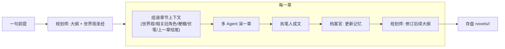

# 武侠小说生成 · Wuxia Novel

一个命令行的**多章武侠小说生成器**：给一句前提，先由**规划师 agent** 立意出大纲 + 世界观圣经，然后逐章"多 Agent 演戏 → 执笔人成文 → 档案官更新记忆 → 修订后续大纲"，把一部长篇一章一章写下来。项目落盘在 `novels/<slug>/`，可随时中断、续写、回退。

> 从"渐进式 Agent 学习项目"里抽出来的独立版本，只保留武侠多 Agent 这一条线。已精简为纯 CLI 多章生成，聚焦三件事：**规划、写书、回退**。

## 核心思路：多 Agent 产情节，单 Agent 出文笔

多角色即兴演出**读起来发散**——每个角色只有局部视角、各求自己那句"最炸"，于是像轮流朗诵、全程满格、旁白重复；而单个作者从头到尾用**全局视角**写，才有节奏张弛、心理描写、伏笔与回收。

所以每一章刻意做成两段式，各取所长：

1. **多 Agent 即兴**（导演 + 角色）：产出带**涌现性**的原始 beats——剧情走向不预设，是人物目标碰撞出来的。
2. **单 Agent 成文**（执笔人 `Novelist`）：拿整章 transcript 一次性改写成小说体，补心理/环境/过渡、调节奏、埋伏笔回收。

> 情节的意外感来自多 Agent，文笔的连贯感来自单 Agent。

## 难点：没有硬规则，"下一个谁行动"成了问题

不同于回合制游戏（出牌顺序由引擎确定性决定），这里**没有硬规则**约束谁该开口/出手。这正是无规则约束下多 Agent 的核心难题——**speaker selection / 调度**。

本项目用**导演/主持人调度**（对标 AutoGen 的 `GroupChatManager`）：一个 LLM 调度者，根据剧情张力、谁被点名、人物动机，逐拍决定谁行动。其他常见解法还有：抢麦竞价（每人自评发言意愿，最高者行动）、点名交接（handoff，@下一个人）、环境感知驱动（如斯坦福 Generative Agents 的小镇）。

## 三大能力

- **规划能力**（`Planner`）：`createOutline` 立意整书主线/分章目标/世界观圣经；目标章数很大时自动切到**分卷滚动规划**（先出卷路线图，只展开第 1 卷，写完再展开下一卷），支撑数百章长篇。每写完一章按实际走向 `reviseOutline` 修订"尚未写"的后续章节。
- **写书能力**（`NovelEngine` + `WuxiaDramaAgent` + `Archivist`）：逐章"演戏 → 成文 → 更新记忆 → 修订大纲 → 存盘"。一次只推进一章，成本随章数线性、单章有界，可随时中断续写。
- **回退能力**（`rollbackChapters`）：回退最近写的 n 章——删产物、大纲状态复位、记忆按快照还原。写本章前会落一份"写之前"的记忆快照，回退后可干净重写。

## 流程



长篇不崩的关键设计：**canon 与进度分离**（世界观圣经 + 人物档案是相对稳定的 canon，事件/伏笔/梗概是叙事进度）；每章只挑**有界**的相关旧角色注入上下文（默认封顶 6 人），并对缺席若干章的**回归者**生成"补账提示"，要求交代其间去向、与上次状态自洽。这样即便"每章一批新人"，跨章的世界与老角色也保持一致，且**单章成本平坦、不随章数膨胀**。

## 目录结构

```
src/
  core/                 # 与业务无关的通用件
    config.ts           # 读取 OpenAI 兼容接口环境变量
    logger.ts           # 步骤级彩色日志
    json.ts             # 从 LLM 文本稳健抽取 JSON 的通用件
    llm/                # OpenAI 兼容 chat 客户端 + 类型 + 调用追踪
  drama/                # 单章多 Agent 演出（演戏 + 成文）
    scene.ts            # Character/Scene/Beat/DramaContext 类型与渲染（纯数据）
    character.ts        # CharacterActor：由人物设定构建系统提示词，第一人称表演
    director.ts         # Director：openScene 造人（注入章节上下文）/ nextBeat 调度选人；含纯函数解析
    novelist.ts         # Novelist：单 Agent 执笔，把整章改写成小说体正文（可承接前文）
    events.ts           # 章节生成的结构化事件类型 + 事件回调（CLI 逐条打印）
    agent.ts            # WuxiaDramaAgent：编排一章（playScene 演出 + novelizeScene 成文）
  story/                # 多章小说（整书）：规划 + 记忆 + 编排
    types.ts            # Outline/WorldBible/CodexCharacter/StoryMemory 等类型（canon 与进度分离）
    genre.ts            # 题材预设与解析
    style.ts            # 写作风味卡（辰东/金庸/古龙…）的加载、解析与渲染
    project.ts          # 磁盘项目存储 + 回退（novels/<slug>/）
    planner.ts          # Planner：规划/修订大纲、分卷路线图；含纯函数解析
    memory.ts           # 记忆纯函数：内核不覆盖 upsert / 有界选取相关人物 / 渲染 / 回归者补账
    archivist.ts        # Archivist：每章更新记忆（内核确定性取自角色定义，LLM 只抽演变）
    engine.ts           # NovelEngine：startNovel / generateNextChapter 串起整条多章流水线
  novel.ts              # 多章 CLI 入口（新建/续写/自动/导入/回退/列表）
  verify.ts             # 成书质检（重复章/世界观覆盖/开场等）
tests/                  # 纯函数单测
eval/                   # 规划/文笔评测
styles/                 # 写作风味卡（JSON）
novels/                 # 生成的小说项目（产物）
```

## 快速开始

1. 安装 [Bun](https://bun.sh)。
2. 复制 `.env.example` 为 `.env`，填入 OpenAI 兼容接口配置（可对接 OpenAI / DeepSeek / Qwen / Kimi / 本地 vLLM 等）：

```
OPENAI_BASE_URL=https://api.deepseek.com
OPENAI_API_KEY=sk-xxxx
OPENAI_MODEL=deepseek-chat
```

> 提示：带 thinking 的推理模型会把思维链 `<think>…</think>` 内联进正文，客户端已统一剥离，不会污染台词或破坏 JSON 解析。

**按角色分模型（可选）**：演戏与成书要的能力不同——角色即兴要"活"，成书/谋篇要"稳"。可用 `OPENAI_MODEL_<ROLE>` 分别指定，缺省回落到 `OPENAI_MODEL`。ROLE 取 `CHARACTER`（角色扮演）、`DIRECTOR`（导演造人/调度）、`NOVELIST`（执笔成书）、`PLANNER`（规划大纲）、`ARCHIVIST`（档案官抽记忆）。例如接 MiniMax：

```
OPENAI_MODEL=MiniMax-M2.5
OPENAI_MODEL_CHARACTER=MiniMax-M2-her   # 角色扮演模型，演戏更活
OPENAI_MODEL_NOVELIST=MiniMax-M3        # 成书最看重文笔与长文连贯
```

## 对外接口（CLI）

唯一对外入口是命令行 `src/novel.ts`（`bun novel*`）。全部命令一览：

| 命令 | 参数 | 能力 | 说明 |
| --- | --- | --- | --- |
| `bun novel "<前提>"` | `<前提>` 必填 | 规划 + 写书 | 新建一部小说：规划大纲 + 世界观圣经，并写第 1 章 |
| `bun novel:auto "<前提>"` | `<前提>` 必填 | 规划 + 写书 | 新建并一口气写完整本（反复推进到无待写章节） |
| `bun novel:next <slug> [n]` | `<slug>` 必填，`n` 默认 1 | 写书 | 给已有小说续写下 `n` 章 |
| `bun novel:rollback <slug> [n]` | `<slug>` 必填，`n` 默认 1 | 回退 | 回退最近写的 `n` 章（删产物、大纲复位、记忆按快照还原） |
| `bun novel:from-eval <目录>` | `<目录>` 必填 | 规划（导入） | 从一次评测（`eval-runs/<...>/`）导入已规划好的大纲落盘成项目，不重新规划 |
| `bun novel:list` | 无 | — | 列出 `novels/` 下所有小说项目 |

**可选参数**（仅新建 `novel` / `novel:auto` / 导入 `from-eval` 时生效）：

| Flag | 取值 | 含义 |
| --- | --- | --- |
| `--chapters=<N>` | 正整数（钳制到 3–2000） | 目标章数；缺省由规划师定（约 6–10 章）。超过阈值自动切分卷滚动规划 |
| `--genre=<题材>` | 预设 id/中文 label，或自定义题材名 | 题材，空则默认武侠 |
| `--style=<风味>` | 预设 id/label（如 `辰东式史诗`/`chendong`），或自定义腔调 | 写作风味，空/`none` 则不启用 |
| `--intensity=<强度>` | `light` / `medium` / `strong` | 风味强度，空则 `medium` |

示例：

```bash
bun novel "少年背负灭门血仇下山寻仇"                        # 新建 + 写第 1 章
bun novel "少年背负灭门血仇下山寻仇" --chapters=20         # 指定目标 20 章
bun novel "宗门弃徒逆袭" --genre=仙侠 --style=辰东式史诗    # 指定题材与风味
bun novel:auto "少年下山寻仇" --chapters=30               # 新建并写完整本（目标 30 章）
bun novel:next 少年下山寻仇 3                              # 续写 3 章
bun novel:rollback 少年下山寻仇 2                          # 回退最近 2 章
bun novel:from-eval eval-runs/2026-07-14T08-40-35-837Z-plan-少年下山
bun novel:list                                            # 列出所有项目
```

**产物**落盘在 `novels/<slug>/`：

- `novel.json` — 元数据（标题/题材/风味/已写章数…）
- `outline.json` — 大纲（分章目标、分卷路线图）
- `memory.json` — 故事记忆（世界观圣经、人物档案、伏笔、梗概）
- `chapters/chNN.md` — 各章正文；另有 `chNN.memory.json`（本章记忆快照，供回退）与 `chNN.transcript.json`（演出记录）

## 其他命令

```bash
# 质检：对已生成的小说跑确定性检查器（重复章 / 世界观覆盖 / 开场等）
bun run verify <slug>
bun run verify --live "<一句前提>" [--chapters=N] [--genre=] [--style=] [--intensity=]   # 真生成前 N 章再评分

# 评测（LLM 评 LLM）
bun run eval plan "<一句前提>" [--genre=仙侠] [--chapters=10] [--rolling]
bun run eval prose <fixtureId|path> [--style=chendong] [--intensity=strong]

# 开发
bun test                # 纯函数单测
bun run typecheck       # 类型检查
```

## 终止与兜底

- `maxBeats` 硬上限保证一章的演出必然收场。
- 导演没指定合法行动者时，回退挑"登场最少"的角色，避免冷场、促进轮转。
- 多章模式下场景生成失败**绝不回退到内置示例场景**（以免污染连载正史）：先重试一次，仍失败则抛错，交由上层重试整章。

## 成本提示

每章 ≈ 一幕的调用量（演出：每拍导演选人 1 次 + 角色行动 1 次，一章约一二十次；成文 1 次较长调用）+ 档案官 1 次 + 规划师修订 1 次；建项目时另有若干次立意/规划调用。得益于"有界上下文"（相关旧角色封顶、梗概滚动重写），**单章成本大致平坦、不随总章数增长**。可调小 `maxBeats`，或用 `bun novel:next` 一章一章来控制耗时与成本。
